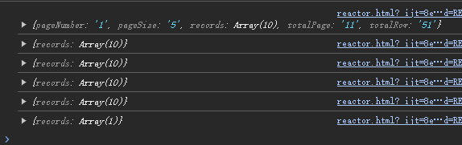
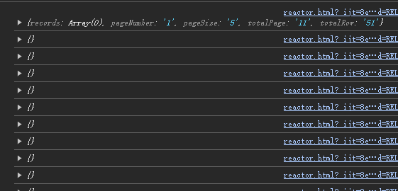

# Mybatis Flex Reactor

此项目基于 Mybatis Flex 构建，仅作拓展，不更改原有逻辑。封装了 Cursor 操作，让 Mybatis Flex 支持**响应式**。

无需破坏原有项目代码，也可以在非 WebFlux 项目中使用

- 如配合 easy-excel 实现大量数据的 EXCEL 操作，无需再担心内存占用问题
- 再比如需要做一些异步非堵塞的数据库操作（写入日志）

注：下面所有代码示例若无特殊说明，均为 `Kotlin` 作为示例代码语言，本项目可供 `Java` 使用。

## 使用方法

下面假定在 Spring Boot 项目中使用 Mybatis Flex

1. 引入依赖

```kotlin
// mybatis-flex
implementation("com.mybatis-flex:mybatis-flex-spring-boot3-starter:1.9.2")
// mybatis-flex-reactor 拓展
implementation("com.juxest:mybatis-flex-reactor-spring:0.2.2")
```

2. 继承 ServiceReactorImpl，实现 ReactorService 接口

```kotlin
class UserService : ReactorServiceImpl<UserMapper, User>()
``` 

仅需两步，你就已经得到了一个具备响应式的 Service

## 有什么用？

当你开始使用响应式数据库操作后，就再也无需再担心内存占用问题，与内存爆满说拜拜

### 与 EasyExcel 交互示例：巨量数据从数据库写入 Excel

```kotlin
class UserService : ReactorServiceImpl<UserMapper, User>() {
    // 在 WebFlux 中，可以将此方法直接作为 Controller 的返回值，供 WebFlux 进行调度，返回数据给前端
    fun writeAllToExcel(): Mono<String> {
        // 目标文件
        val tempFile = File.createTempFile("user", ".xlsx")
        // 创建 EasyExcel 的 writer 与目标 sheet
        val writer = EasyExcel.write(tempFile, UserExportVo::class.java)
            .registerWriteHandler(LongestMatchColumnWidthStyleStrategy())
            .build()
        val sheet = EasyExcel.writerSheet(1).build()
        // 调用响应式的 listAs 方法
        return listAs(QueryWrapper.create(), UserExportVo::class.java)
            // 这里可以预处理数据
            .doOnNext { it.name = "${it.id} ${it.name}" }
            // 选择缓存大小，即多少条数据一起写入 Excel
            .buffer(100)
            // 写入到 Excel
            .doOnNext { writer.write(it, sheet) }
            // 做结尾操作，使用 then 只接收信号而不接收数据
            .then()
            // 结束后关闭 writer
            .doOnTerminate { writer.finish() }
            // 返回文件路径
            .thRerturn(tempFile.absolutePath)
            // 即使出错也会关闭 writer，防止可能的资源泄漏
            .doOnError {
                writer.finish()
                it.printStackTrace()
            }
    }
}
```

### 与前端 fetch 交互示例：对于大量数据分页的替代，数据即时显示，无需等到全部数据加载完

同时可以配合前端各种框架的“虚拟滚动”或者“虚拟表格”组件，减少内存占用，提升性能。下面为原生 JavaScript 的示例：

后端：

```kotlin
@Service
class UserService : ReactorServiceImpl<UserMapper, User>()

@RestController
class UserController(
    private val userService: UserService
) {
    /**
     * ND_JSON_VALUE 可以让 Flux 每条数据都是单独的 JSON 格式
     * 返回数据类似：
     * > {...}
     * > {...}
     * > {...}
     * 若未设定 produces，会是：
     * > [{...},
     * > {...},
     * > {...}]
     */
    @GetMapping("/users", produces = [MediaType.APPLICATION_NDJSON_VALUE])
    fun getUsers(): Flux<User> = userService.list()
        // 每条数据模拟延迟 1 秒
        .delayElements(Duration.ofSeconds(1))
}
```

前端：

```html
<!DOCTYPE html>
<html lang="cn">
<head>
    <meta charset="UTF-8">
    <title>Reactor - Test</title>
</head>
<body>
<div id="table" style="display:flex;flex-direction: column">

</div>

<script>
    const element = document.querySelector('#table');
    const decoder = new TextDecoder();
    const loadData = async () => {
        const response = await fetch('http://localhost:8080/users');
        const reader = response.body.getReader();
        // 不断读取数据直到收到完成的指令
        while (true) {
            const {done, value} = await reader.read();
            if (done) {
                break;
            }
            const text = decoder.decode(value).trim();
            // WebFlux 返回数据可能会一次返回几行单个数据，所以这里需要手动分割
            text.split('\n').forEach(line => {
                // 解析成 JSON
                line = JSON.parse(line);
                element.innerHTML += `<span>${line.id} --- ${line.name.substring(0, 1)}</span>`;
            });
        }
    };
    loadData();
</script>
</body>
</html>
```


### 异步写入日志

很多时候日志的优先级并没有那么高，但总是需要进行记录，有时候日志数据量比较大（或者需要进行额外的网络请求），就会堵塞主逻辑较长时间。
此时我们就可以采用 ReactorService 来解决：

```kotlin
@Service
class LogService : ReactorServiceImpl<LogMapper, Log>()

class TestController(
    private val logService: LogService
) {
    @GetMapping("/test")
    fun test() {
        println("1")
        // 2
        logService.save(Log("test"))
            // 将执行时机改为弹性调度，避免阻塞主线程
            .subscribeOn(Schedulers.boundedElastic())
            .subscribe()
        /**
         * 你也可以用下面这个方式：
         * ReactorUtils.runAsync(
         *     logService.save(Log("test"))
         * )
         * 与上一种方式等效
         */
        println("3")

        // 观察控制台输出，结果将会是 1 -> 3 -> 2(SQL 日志)
    }
}
```

## 自定义 SQL 查询实现响应式

要实现这个功能其实非常简单，MybatisFlex 默认开启了流式查询，所以只需要在 `BaseMapper` 中编写一个返回 `Cursor` 的方法即可。
最后在 `Service` 中调用 `ReactorUtils.cursorToFlux(() -> getMapper().xxx());` 即可

需要注意的是，此处需要传入的参数是 `Supplier<Cursor>` 函数，而不是 `Cursor` 类型

```kotlin
interface UserMapper : BaseMapper<User> {
    @Select("select * from user where name = #{name}")
    fun selectAllByName(name: String): Cursor<User>
}

@Service
class UserService : ReactorServiceImpl<UserMapper, User>() {
    fun selectAllByName(name: String): Flux<User> =
        ReactorUtils.cursorToFlux {
            getMapper().selectAllByName(name)
        }
}
```

## 游标分页

在特定的业务场景下，我们可能“既要又要”：既需要快速的数据响应，低内存占用消耗，同时又需要对数据进行分页（因为对于大体量数据的游标查询，占用带宽和数据库链接的时间会很长）

此时我们可以更改一下传统的前端逻辑：

### 对于数据时效性不强的业务

1. 前端先请求一次 count 接口，获取并储存数据总量信息，自计算分页信息（如总页码、当前页码）
2. 前端构建分页对象，自携带数据总量信息，请求分页数据接口

### 对于数据时效性强的业务

前端与后端协商接口数据响应逻辑，比如

1. 对分页响应数据封装一个实体类，`Flux` 流第一条数据为 `{total: 100, ...其它分页信息, data: {}}`，后续数据为 `{data: {}}`
   ```kotlin
    interface Record<T> {
        fun getRecords(): MutableList<T>
    }

    class JustRecord<T>(
        @get:JvmName("_get")
        val records: MutableList<T>
    ) : Record<T> {
        override fun getRecords(): MutableList<T> = records
    }

    class PageInfoRecord<T>(pageNumber: Int, pageSize: Int) : Record<T>, Page<T>(pageNumber, pageSize) {
        fun records(records: MutableList<T>): PageInfoRecord<T> {
            this.records = records
            return this
        }
    }

    @GetMapping(produces = [MediaType.APPLICATION_NDJSON_VALUE])
    fun fetchUserPage(): Flux<Record<User>> {
        val userPage = PageInfoRecord<OperationLog>(1, 5)
        return logService.page(userPage)
            .buffer(10)
            // 生成索引
            .index()
            .map {
                // 第一个元素，包含分页信息
                if(it.t1 == 0L) userPage.records(it.t2)
                // 后续元素仅有 records
                else JustRecord(it.t2)
            }
    }
   ```
   
2. `Flux` 流第一条数据为分页对象 `{total: 100, ...其它分页信息}`，后续数据为单条数据 `{}`
   ```kotlin
   @GetMapping(produces = [MediaType.APPLICATION_NDJSON_VALUE])
   fun test(): Flux<Any> {
       val userPage = Page.of<OperationLog>(1, 5)
       return (userService.page(userPage) as Flux<Any>)
           .startWith(userPage)
   }
   ```
   

## 使用堵塞 / 同步方法（传统 Flex Service）

如果业务中需要堵塞执行获取方法结果，又或是需要使用传统的 Service 方法，可以参考以下方法：

1. 使用 `ReactorUtils.runBlock(Mono<T>)` 方法获取结果

   注：在 `ReactorService` 中，我们为返回 `Flux` 的方法提供了后缀为 `Once` 的方法，如 `getObjectListOnce`
   ，这些方法将会返回 `Mono`，这样你就可以调用上面工具类的 `runBlock` 方法堵塞获取结果
2. 如果是在 Spring 的环境下，若你的 `Service<T>` 继承了 `ReactorServiceImpl<T>`，那么将会自动注入你已有的 `IService<T>`
   。如果你并没有注册任何 `IService<T>` Bean，那么 `ReactorServiceImpl<T>` 将会自动创建一个实现了 `IService<T>` 对象。
   使用 `getBlockService()` 方法即可获得传统的 Mybatis Flex 的 `IService<T>`
   对象，你就可以以堵塞的方式操作数据库了，如：`userService.getBlockService().list()` 将会返回一个 `List<User>`